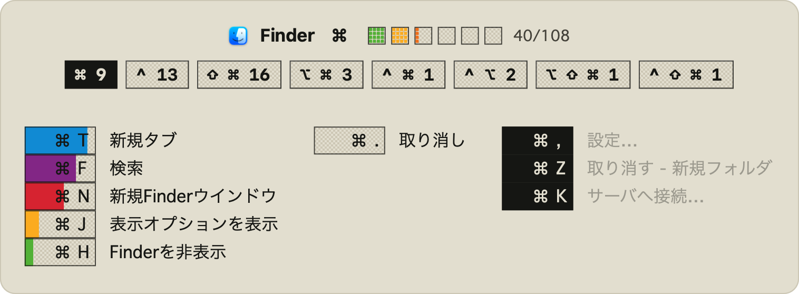
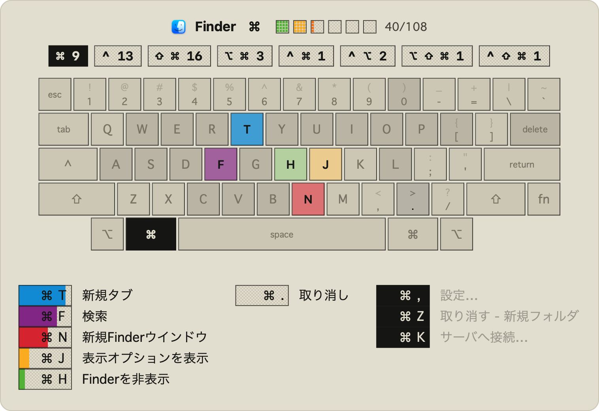

# KeyHUD

修飾キー（⌘ / ⌃ / ⌥）を押したまま少し待つと、いま使っているアプリで実際に効くショートカットがパネルに出る macOS の常駐ツールです。

キーを離せば消えます。押している修飾キーを変えると、その組み合わせで効くものだけに絞り込まれます。



キーボード表示に切り替えると、押せるキーが実際の配列の上で光ります（画像は HHKB US 配列）。



左端の帯とキーの色は、そのショートカットをどこまで覚えたかです。1977年のロゴの6色をそのまま段階に使っていて、緑が覚え始め、青が習得間近。上部の6マスはアプリ全体の習得数で、覚えるほど左から埋まります。黒い3つは習得済みで、名前が薄くなります。

> 画像の学習状態は、機能が見えるように作った例示用のデータです。ショートカットの一覧そのものは実際の Finder から読んだものですが、進捗の数値は実使用の記録ではありません。

**インストール**

macOS 13 以降。Xcode コマンドラインツールが必要です（Swift 5.9）。外部ライブラリへの依存はありません。

```bash
git clone https://github.com/ukirose/keyhud.git && cd keyhud
./dev.sh build && open KeyHUD.app
```

初回はアドホック署名になります。`./setup-signing.sh` を一度実行して自己署名証明書を作っておくと、ビルドのたびに許可を与え直さずに済みます（macOS の許可は署名に紐づくためです）。

起動時に、アクセシビリティ（前面アプリのメニューバーを読むため）と、入力監視（修飾キーが押されたことを知るため）の2つの許可を求められます。どちらも macOS の設定画面で手動で与える必要があります。許可後に再起動すると、メニューバーに常駐します。

**開発**

```bash
./dev.sh test     # テスト（158件）
./dev.sh lint     # コンパイラが検出できない種類の検査
./dev.sh render   # パネルを実コードで画像に描き出す（上の画像はこれで生成）
```

**保存されるデータ**

`~/Library/Application Support/KeyHUD/` に置かれます。外部への送信は一切ありません。

**配色**

初代 Macintosh に寄せてあります。System 7 の Platinum のベージュ、1bit 時代のグレーの作り方であるディザ（市松）、直角と1pxの枠、そして macOS に今も同梱されている Geneva。進捗に使っている6色は 1977年の Apple ロゴのものです。メニューバーから Ghostty の設定に追従させたり、他のテーマに変えたりもできます。

**構成**

macOS のアクセシビリティ API で前面アプリのメニューバーを読み、メニュー項目に付いているキー割り当てを集めて表示しています。そのため、アプリごとの対応は不要で、メニューを持つアプリなら何でも出ます。メニューに載っていないシステムのテキスト編集キー（⌃A / ⌃E / ⌃K など）は、AppKit の `StandardKeyBinding.dict` から別途読んでいます。

判断を担う部分は AppKit から切り離してあり、テストから1イベントずつ動かせます。

| ファイル | 役割 |
|---|---|
| `HoldMachine.swift` | 「押している」のか「使っている」のかを判定する状態機械。タイマーもUIも持ちません |
| `ChordMatch.swift` | 打鍵と、アプリのショートカット表の照合 |
| `PanelContent.swift` | 何を出すかの決定 |
| `MenuScraper.swift` | メニューバーの読み取りとキー割り当てのデコード |
| `LearningStore.swift` | 学習状態の永続化 |

制作期間は 2026-08-02 〜 2026-08-03 の2日間です（最初のプロンプトからカウント）。

---

## 何を作ろうと思ったか

ショートカットをもっと使えるようになりたくて、そのためのツールを作りました。

修飾キーを押している間だけ、そのアプリで実際に効くショートカットが出て、また覚えること自体が楽しくなるように、ゲーミフィケーション要素を足そうと思いました。

## なぜか

小さな不便を探す中で、キーボードとマウスの持ち替えは面倒だと考えました。

自分のショートカット使用状況を測ると、日常的に利用するアプリで使えるショートカット数百個のうち、実際に使っているのは 24 個（3.3%）で、上位5個が全使用の 80% を占めていました。

呼び出して一覧を見る形式のツールは既にありますが、それだと「調べよう」と思った時にしか開きません。知らないものには、そもそも調べる動機が湧きません。

そこで、修飾キーを押した時点で勝手に出る形にしました。修飾キーを押しているのは、基本的にショートカットを打とうとしている瞬間です。そこに出せば、打とうとしていた1個のついでに、その組み合わせで効く残り全部が目に入ります。すでに毎日何十回も行っている動作に相乗りする形です。

もう一つの動機が、覚える過程を楽しくすることでした。一覧が出るようになっても、覚えるかどうかは自分次第です。そこで、身についた度合いを見えるようにしました。

- パネルを見てから打ったものは「調べた」、見ずに打ったものは「思い出した」として別に数え、後者だけがポイントとして加算されます
- 進み具合は、行の色が段階を、ヘッダーの6マスがアプリ全体の習得数を示し、覚えるほど左から埋まっていきます
- 習得しきったものは黒く落ち着いて、名前が薄くなります

方針として決めたことがあります。身についたものを隠したり、覚えるまで見せないようにしたりはしません。補助ツールが情報を出し惜しみした時点で、第一の機能が壊れるからです。習得済みのものも薄く表示されるだけで、いつでも読めます。

## 生成AIとのやり取り（プロンプトの履歴や工夫したやり取りなど）

実装そのものは AI に任せ、時間は「返ってきたものを採るかどうか」の判断に使いました。以下は、その判断が実際に何を変えたかです。

**1. 断定を、そのまま受け取らない**

F3 のショートカットが効かないという症状が出たとき、AIは「キーマップ定義が間違っている」と結論しました。自分で `keyboard.json` を見た限り、間違っているようには見えません。そこで、キーマップは正しく見えること、F3 は Fn と同時に押す必要があるのでそちらが原因ではないかという別の仮説、そして macOS 向けの HHKB 用 OSS が同じ問題をどう扱っているかを調べること、の3つを指示しました。

実際の原因は両方とも外れで、macOS が F3 を Mission Control として先に奪っていました。それでも意味はありました。どちらが正しいかではなく、断定を止めた時点で作業が調査に切り替わるからです。

**2. 同じ形のバグが続いたら、修正ではなく原因を問う**

これが一番効いた指示だと思っています。似た形の不具合が3回続いたところで、次の修正を依頼する代わりに、これまでの修正が局所的になっていないか、設計上の原因があるのかを問いました。

返ってきたのは「4つの再発パターンがあり、いずれも原則がコメントに書いてあって型に書かれていないことが原因」という分析でした。そこから、状態機械の切り出し・値型化・レコードのバージョニング・独自 lint の4点に作り直しています。修正を頼んでいたら、4回目の同じバグを踏んでいました。

**3.「直った」の証拠を要求する**

AIは自信を持って「修正しました」と言います。そこで、新しいテストや検査を足したら、わざと壊して、ちゃんと落ちることを確認してから信じるというルールを課しました。

これで出てきたのが、自作 lint の4ルールのうち、2つが絶対に落ちない検査だったという事実です。片方は正規表現が `let x: CGFloat = 3` を誤って除外し、もう片方は否定文字クラスが改行にマッチして、15個あるプロパティを3個しか見ていませんでした。どちらも「0 problems」と表示していました。

同じルールで、後からこれらも出ています。

- パネル画像の前後比較が「32枚中32枚に差分あり」と出たが、同じビルドで2回撮っても同じだけ差分が出た。全部が環境ノイズで、コードによる差分は1件も無かった
- 画像比較を安定させるために入れた再現用スイッチが、プレビューと実表示が共有する関数の中にあり、実際のキー操作の挙動まで変えていた
- 「新しいビルドで起動しました」と報告されたが、その同じ出力に `binary 01:31:45` と書いてあった。修正を入れたのは 02:14 で、再起動スクリプトが「バイナリがソースより新しいか」を見ていなかった

3つ目は、報告文ではなく出力に印字された数字を読んだから分かりました。

**4. 教訓をファイルに残させ、次のセッションに効かせる**

失敗するたびに、その教訓をエージェントが常時読み込む設定ファイルに書き残すよう指示しました。セッションを跨ぐと文脈は消えるので、これで次の最初から効きます。溜まっているのは、たとえば次のような項目です。

- 落ちない検査は検査ではない
- 検証方法の結論を信じる前に、検証方法自体を検証する
- 自分の証拠が何を見ていないかを、結果と同じ息で言う
- 「収束する」と言う前に、ゼロに到達するか確かめる

**5. 作る前に「原理的に可能か」を測らせる**

「マウスでよくやっている操作をショートカット候補として出す」という案を思いついたとき、実装を頼む前に、そもそもマウスで何をしているかを原理的に取得できるのかを確かめさせました。

測定用のコードを書かせて、普段使う4つのアプリで測った結果は否定的で、Web ベースのアプリでは操作対象に名前が付いておらず、ボタンが押されたことは分かっても、それが何のコマンドか分からないと出ました。案は捨てました。「作れるか」の前に「成立するか」を聞くのは、AIに対して特に効きます。頼めば作れてしまうので。

**6. 目的に照らして提案を却下する**

学習を促す仕組みを相談したとき、AIは keybr 式（習得したものから順に解禁していく方式）を提案してきました。これは補助ツールであってその機能を害してはならないこと、そして keybr 式は使いたいショートカットが事前に分かっていなければ成立しないことを挙げて却下しています。

情報を出し惜しみすることは、このツールの第一の機能を壊します。そして keybr は練習対象を自分で選べますが、このツールは「何を覚えるべきか分からない」人のためのものなので、前提が成り立ちません。目的に照らした却下は、こちらが持っている必要がある判断です。

**7. 仕様の判断は渡さない**

エディタで ⌃ を押しっぱなしにして連打すると、そのたびにパネルが出て邪魔になる問題がありました。AIは閾値を上げる案と学習状態で抑制する案を出してきましたが、どちらも大きすぎます。こちらから出したのは、⌃ と何かのキーが押されたら待ち時間のカウントをリセットすればよいという案です。

そのまま実装になりました。既存のコードには「押しっぱなしの間は抑制する」仕組みがありましたが、一度離すと解除されるため連打では毎回出ていた、というのが実際の穴でした。

**8. 意味を持たない表現を許さない**

学習の進み具合が水色で塗られていたとき、それが水色である必然性がないと指摘しました。単一の色は「なぜその色か」に答えられません。そこで色を、ロゴの6色の上の位置に置き換えました。緑が覚え始め、青が習得間近で、ヘッダーの進捗も同じ順で埋まります。位置なら、なぜその色かに答えられます。

同じ理由で、パネル上部に入っていたレインボーの帯は却下しました。情報を持たないのに毎回目に入るからです。色は飾りではなく、進捗そのものに持たせました。

**9. 見切りをつける**

「本物のドットにしたい」という方向で、低解像度で描いて拡大する案を試させました。結果はドットではなく、ただ鈍い画面でした。アンチエイリアス済みの描画を縮小しても、ピクセルにはなりません。

必要な ⌘ と ⌥ と日本語をすべて持つ自由なドットフォントが存在しないことは、事前に字形を数えて確認済みでした（DotGothic16 は ⌘ を持たず、fusion-pixel は ⌥ を持ちません）。打つ手が無いと分かった時点で、この方向は捨てています。設定としても残していません。動かない選択肢を残すと、あとで誰かが期待するからです。

## 詰まったところとどう乗り越えたか

前節の 1・2・3・7 は、そのまま詰まった箇所でもあります。ここでは、AIの調査が届かなかったものを書きます。

**ターミナルでだけ記録されませんでした**

Ghostty でだけ、何度打鍵しても使用が記録されませんでした。AIはログから「照合に失敗したのではなく、打鍵イベント自体が1件も届いていない」ところまでは特定しましたが、そこで止まりました。

原因に気づいたのは自分です。Ghostty が画面に出していた説明を見つけ、そのスクリーンショットを貼ってこれが関係あるかと尋ねました。

macOS の Secure Input（パスワード入力時などにキーイベントを他プロセスから隠す機能）でした。これは回避すべきものではありません。セキュリティ機能を迂回することになるからです。正しい対応は検出して表示することだと決めて、そう指示しました。AIが調査を尽くしても届かない範囲があり、画面に出ている情報を見るのはこちらの仕事だったという例です。

**「読めるはず」のものが読めませんでした**

システム側のホットキー（⌃← で操作スペース移動など）も表示したいと考え、システム設定の画面をアクセシビリティ API で読ませようとしました。結果は要素数 0 です。SwiftUI で作られた設定画面は、子要素を外部に公開していませんでした。

ここで「対応表を手で書き写す」案が出ましたが、それだと押しても効かないキーを教えてしまう危険が残ります。方針を変えさせたところ、`SkyLight.framework` の `CGSGetSymbolicHotKeyValue` が見つかりました。ウインドウサーバに直接問い合わせるもので、設定ファイルに記録されない既定値も含めて実際の割り当てが返ります。226個のIDが応答しました。非公開APIなので `dlsym` で引き、見つからなければこの機能ごと黙って消える設計にします。

**体感で気づいたことを、ログで裏取りしました**

「⌃ を押しっぱなしにするとパネルが邪魔だ」という体感の問題として報告したところ、ログには `assisted ... score=0` が並んでいました。体感の問題だと思っていたものが、学習モデルの機能不全そのものだったわけです。実際、テキスト編集の記録4件のうち2件が0点で止まっていました。

体感で気づいたことは必ずログで裏を取らせる、という進め方にしています。逆に、ログだけ見ていても「邪魔だ」には辿り着きませんでした。

**緑が証拠になっていないテストがありました**

テスト3件が、実行するたびに通ったり落ちたりしました。原因は、パネルの生成がテキスト編集層を出すかどうかを決めるために、実機のウインドウサーバに「いまどこにフォーカスがあるか」を問い合わせていたことです。つまり、suite を走らせた瞬間に入力欄が選択されていたかどうかで結果が変わっていました。

その3件はどれも「どの行が描かれたか」を検査するものだったので、緑であること自体に意味がありませんでした。テキスト編集層を外から差し込める継ぎ目を作り、テストは空を渡すようにしています。

直したあとで、継ぎ目に実データを流し込むとその3件だけが落ちることも確認しました。そうしないと「フォーカスがたまたま外れていただけ」と区別が付きません。

## 次にやるなら何を変えるか

**実装として残っているものが3つあります。**

- **システムホットキー層** — `CGSGetSymbolicHotKeyValue` が動くことは確認済みです。ただし名前の対応表が公開されておらず、複数のIDが同じキーを主張する衝突もあります。名前に確信が持てるものだけ出す方針で進めます
- **Secure Input の検出** — 検出自体は1関数で済みます。今は黙って何も記録されないので、そう表示するだけで原因調査の往復が消えます
- **アプリ固有とシステム共通の区別** — 現状はパネル上で同じに見えます。⌘S（アプリ固有）と ⌃A（どこでも効く）は覚える価値が違うので、分けて表示します

**対象の広さも変えます。** キーボード配列は HHKB US 配列が組み込みで、UI は日本語です。他の配列は `keyboard.json` を置けば差し替わりますが、生成ツールを用意していません。
